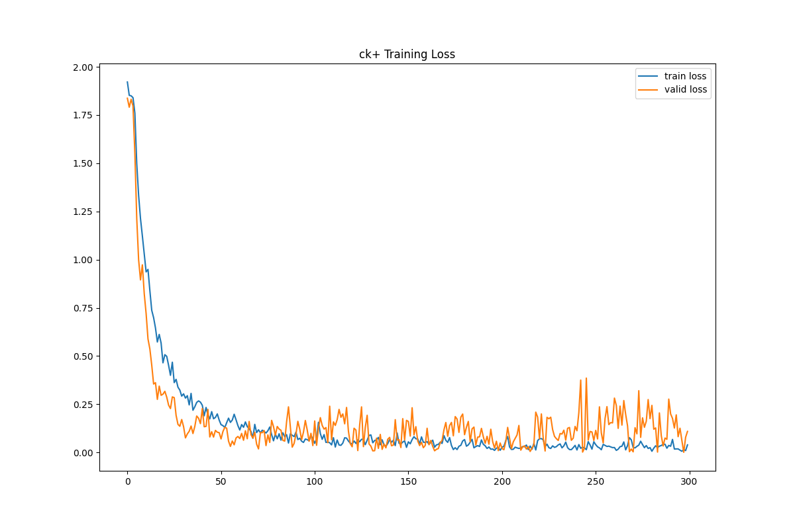
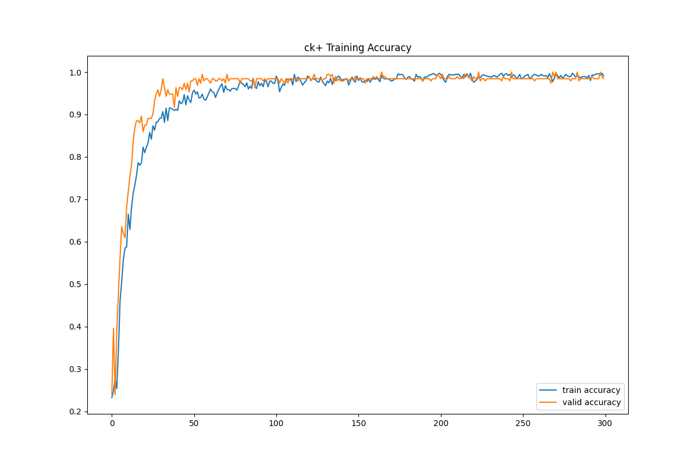
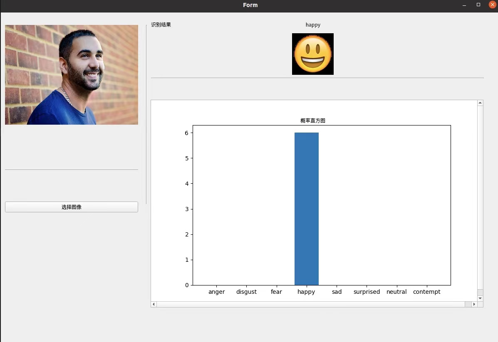
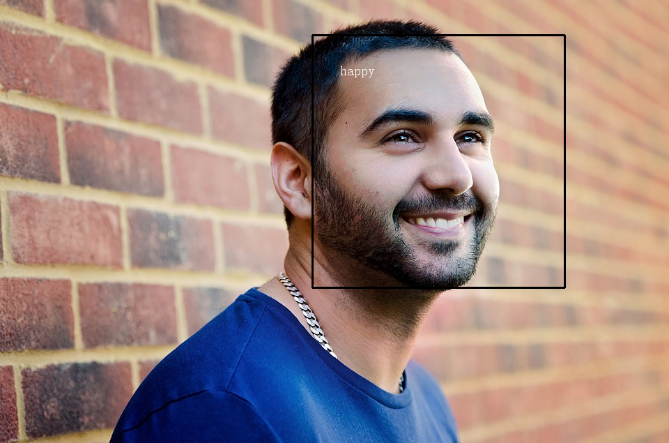

# 人脸表情识别

## 简介
本项目使用卷积神经网络（CNN）构建整个系统。在FER2013、JAFFE和CK+三个表情识别数据集上进行模型评估。


## 环境部署
项目在Linux系统上搭建，请采用Linux作为运行环境，工程基于Python3和Keras2（TensorFlow后端），具体依赖安装如下(推荐使用conda虚拟环境)直接执行根目录下的`env.sh`即可一键配置环境，执行命令为`bash env.sh`。


## 数据准备
数据集和预训练模型均已经上传到GitHub，路径`./assets` 中，可以自行添加或删减。

## 项目说明
### **方法流程**
- 数据预处理
	- 图片降噪
	- 人脸检测（HAAR分类器检测（opencv））
- 人脸检测
	- HAAR分类器
	- MTCNN（效果更好）
- 卷积神经网络
  - 用于特征提取+分类


## 网络设计
使用经典的卷积神经网络，模型的构建主要参考2018年CVPR几篇论文以及谷歌的Going Deeper设计如下网络结构，输入层后加入(1,1)卷积层增加非线性表示且模型层次较浅，参数较少（大量参数集中在全连接层）。
<div align="center"></div>
<div align="center"></div>


## 模型训练
主要在FER2013、JAFFE、CK+上进行训练，JAFFE给出的是半身图因此做了人脸检测。

执行下面的命令将在指定的数据集（fer2013或jaffe或ck+）上按照指定的batch_size训练指定的轮次。训练会生成对应的可视化训练过程，下图为在Ck+数据集上训练得到的结果。

```shell
python src/train.py --dataset fer2013 --epochs 300 --batch_size 32
```



### **GUI界面**
本项目还使用Qt完成了一个简单的demo设计，可以导入图片并显示预测出来的人脸表情结果以及计算得出的表情概率直方图。
注意，**GUI界面预测只会显示最可能是人脸的那个脸表情，但是对所有检测到的人脸都会框定预测结果并在图片上标记，标记后的图片在output目录下。**

执行下面的命令即可打开GUI程序，该程序依赖PyQT设计，在一个测试图片（来源于网络）上进行测试效果如下图。

```shell
python src/gui.py
```


上图的GUI反馈的同时，会对图片上每个人脸进行检测并表情识别，处理后如下图。


